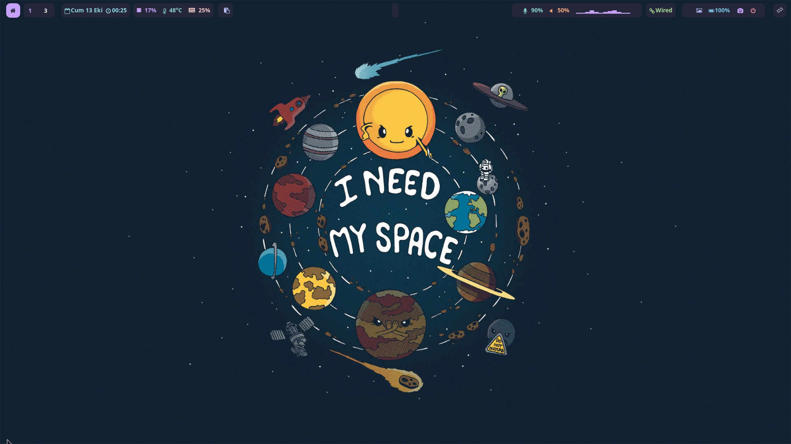
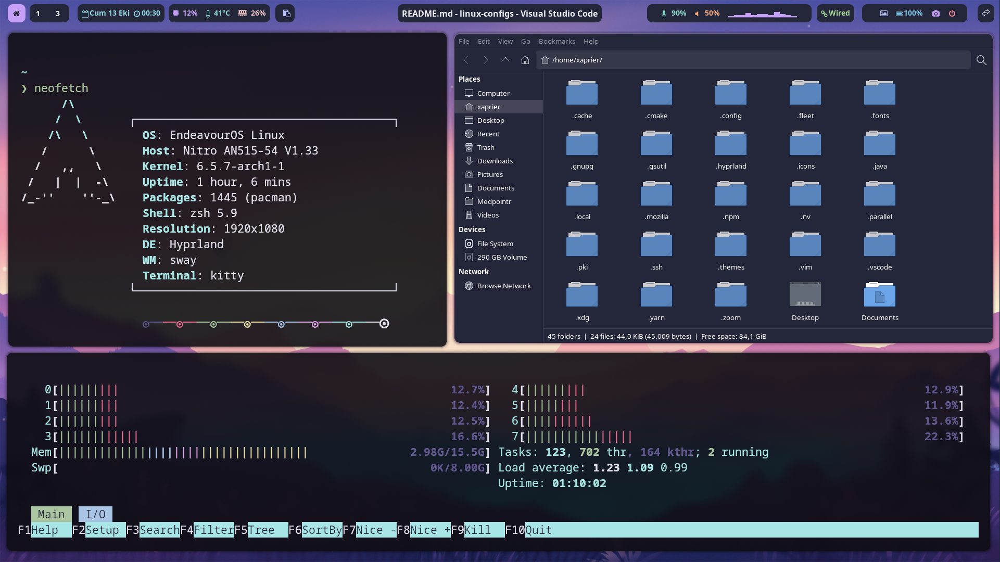

# i3 Settings

## Dependencies that I used

- hyprland(wayland window manager)
- waybar-hyprland-git(top bar)
- cava-git(audio visualizer)
- mako(notifier)
- kitty(terminal)
- playerctl(media controller)
- picom(compositor)
- rofi-lbonn-wayland-git(application launcher/window switcher)
- swaylock-effects
- mpd(music player daemon)
- thunar(file manager)
- zsh
- wl-clipboard(clipboard utility)
- wireplumber(for screen sharing)
- xdg-desktop-portal-hyprland-git
- swaybg(background manager)
- rofi-greenclip
- gnome-calendar
- viewnior(image viewer)
- if something else require that i missed, please open new issue or fork the project and add them here than create a pull request

## Installing Hyprland

### NVIDIA Users

```sh
yay -S hyprland-nvidia-git
```

### Other

```sh
yay -S hyprland-git
```

## Installing Other Dependencies
```sh
yay -S waybar-hyprland-git cava-git mako kitty playerctl picom rofi-lbonn-wayland-git swaylock-effects mpd thunar zsh wl-clipboard wireplumber xdg-desktop-portal-hyprland-git swaybg rofi-greenclip gnome-calendar viewnior
```

## Installing configs
```sh
cp -r cava hypr kitty mako mpd rofi swaylock viewnior waybar ~/.config
```

## Do not forget to

- Changing your startup wallpaper in hypr/scripts/startup
- Changing your wallpaper directory in hypr/scripts/background for randomized wallpaper

## Exit and login to Hyprland

# Screenshots




# Videos

https://user-images.githubusercontent.com/69122856/232256397-3684e3c6-f68b-4fca-8a9e-2c394b12e392.mp4
