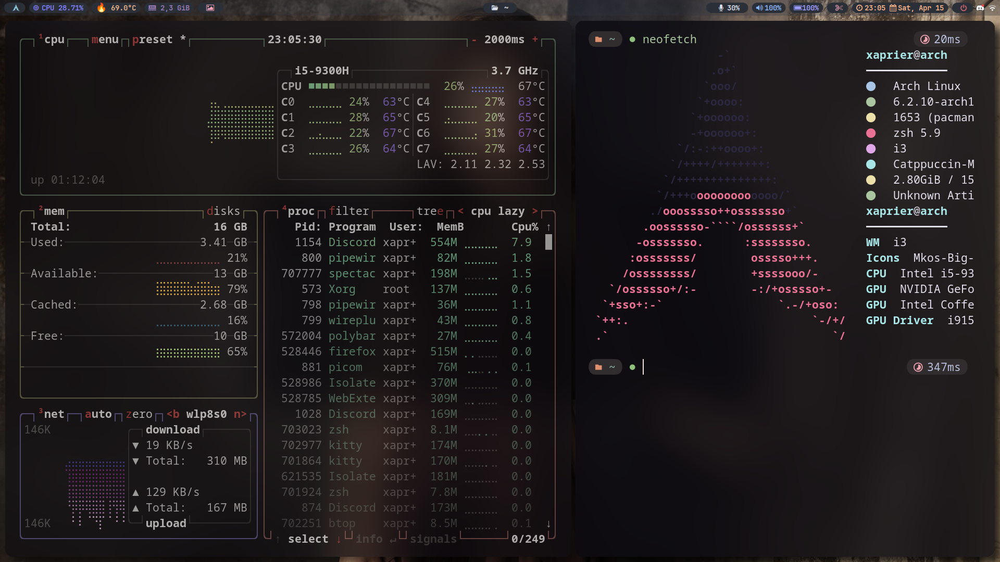

# i3 Settings

## Dependencies

- i3
- polybar
- rofi(catppuccin)
- playerctl
- picom
- feh(wallpaper-change)
- lm_sensors
- btop
- pamixer
- slop
- xdotool
- nitrogen(wallpaper-slide)
- nerd-fonts-git
- ffcast(screenshot in rofi)
- xclip(screenshot in rofi)
- dunst(notify sender)
- libinput-gestures(aur)
- [spotify-cli](https://github.com/pwittchen/spotify-cli-linux)
- [greenclip](https://github.com/erebe/greenclip)
- if something else require that i missed, please open new issue or fork the project and add them here than create a pull request

## Installing Dependencies

```sh
yay -S i3-wm polybar slop xdotool rofi playerctl picom feh lm_sensors btop pamixer nitrogen nerd-fonts-git xclip ffcast dunst
pip install spotify-cli-linux
```

or

```sh
paru -S i3-wm polybar rofi libinput-gestures playerctl picom feh lm_sensors btop pamixer nitrogen nerd-fonts-git xclip ffcast dunst
```

## Installing configs
```sh
cp -r i3 neofetch polybar rofi ~/.config
````

## Do not forget to
- Adding your user to input
  - ```sh
    sudo gpasswd -a $USER input
    ```
- Starting gestures
  - ```sh
    libinput-gestures-setup autostart
    ```
- Changing your wallpaper directory in i3/scripts/wallpaper-change.sh
- Changing your wallpaper directory in polybar/scripts/nitrogen-wallpaper-slide.sh
- Changing your sound sources in polybar/modules.ini, look for "alsa_input.pci"
  - ```sh
    pamixer --list-sources
    ```

## Reload i3

```sh
i3-msg restart
```

# Screenshots



# Videos

https://user-images.githubusercontent.com/69122856/232256397-3684e3c6-f68b-4fca-8a9e-2c394b12e392.mp4
